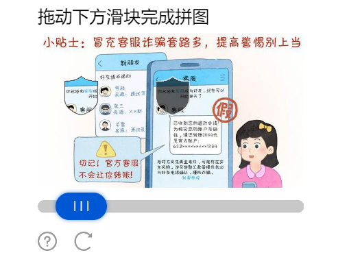
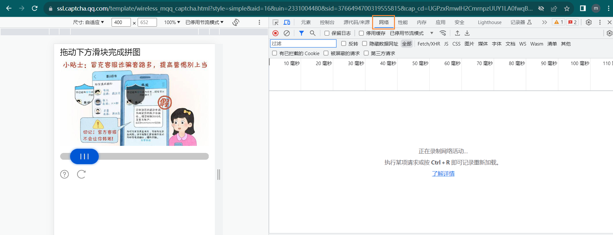
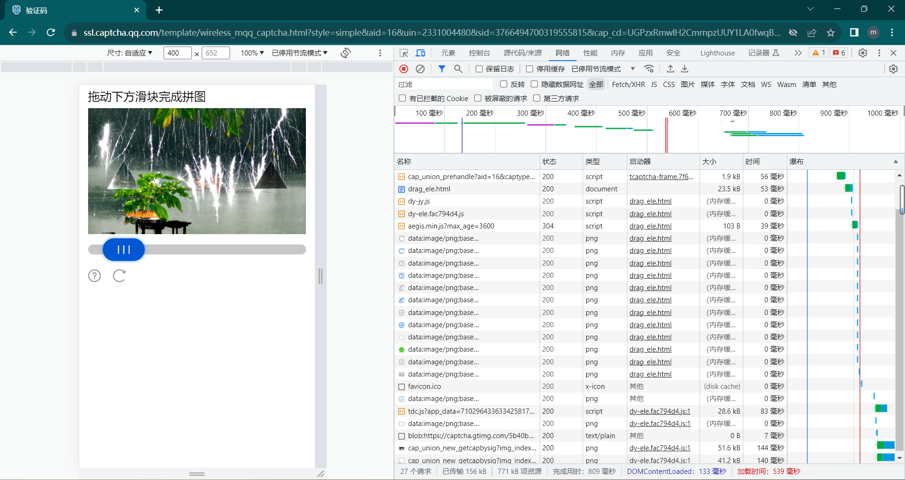
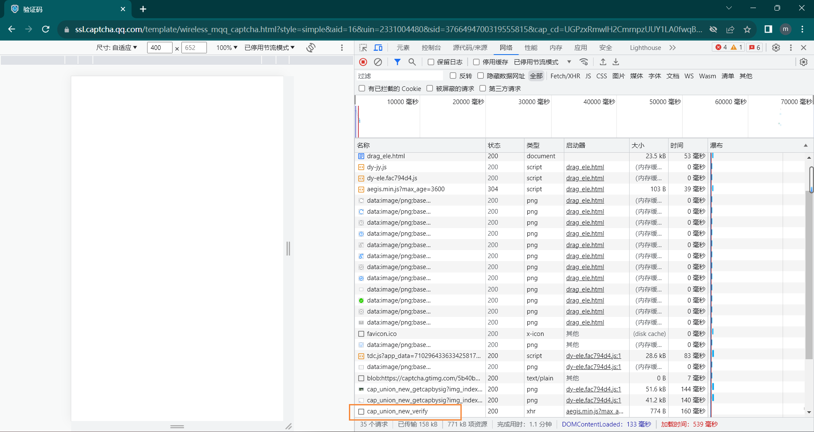
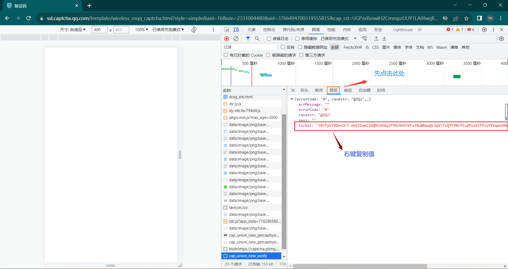

# 关于滑条验证的手动抓取提交

> 由于近期使用人数过多，可能导致自动提交网站可能失效，在此介绍如何手动抓取提交，下面以Google浏览器为例，进行操作(其他浏览器的操作大同小异)。

## 操作步骤

> 注意：首先您要配置好go-cqhttp的其他内容，而且滑条验证码处，您选择的提交滑块ticket方式为 `2.手动抓取提交`

- [x] 输入 `2`后回车， 会出现以下提示：
	```cmd
	[WARNING]: 请前往该地址验证 ->验证网址
	[WARNING]: 请输入ticket： (Enter 提交) 
	```

- [x] 将验证网址复制输入到浏览器中并访问，会出现以下内容：
	<p align="center">
        
        <p align="center">
          <span>手动抓取滑块1</span>
        </p>
    </p>

    点击 `F12` 按钮，然后在出现界面点击 `network(网络)` 选项，若无此选项，则请点击 `...` 选项找 `network(网络)` 选项并点击。如下图所示。
    <p align="center">
        
        <p align="center">
          <span>手动抓取滑块2</span>
        </p>
    </p> 

- [x] 点击后，根据要求，按住 `Ctrl`+`R` 进行网络活动录制，此时左边的滑块验证就会刷新(如下图所示)，此时完成滑块验证。
	<p align="center">
        
        <p align="center">
          <span>手动抓取滑块3</span>
        </p>
    </p> 

- [x] 此时观察右侧的控制台中的某一个赋值响应，可见 `图.手动抓取滑块4` 中的黄色放框内容。此时点击此响应，点击 `预览` 后即可发现 `ticket`，见 `图.手动抓取滑块5`，在 `ticket` 上右键选择 `复制值` 即可复制 `ticket`.
	<p align="center">
        
        <p align="center">
          <span>手动抓取滑块5</span>
        </p>
    </p>
    <p align="center">
        
        <p align="center">
          <span>手动抓取滑块5</span>
        </p>
    </p>

- [x] 最后将复制的值粘贴在 `go-cqhttp.bat` 页面中回车即可。大概如下方：
	```cmd
	[WARNING]: 请前往该地址验证 ->验证网址
	[WARNING]: 请输入ticket： (Enter 提交)
	复制的值 
	```

- [x] 此时成功会让你进行手机QQ验证或者直接登录，若未成功可看下方<a href="#video">视频教学部分</a>。

## 视频教学

[点击此处查看教学视频]("../../img/little-Python-software/手动抓取滑块视频教学.mp4")
(暂不支持播放)
~~如果还是无法成功，开发者也表示无奈，您只能自己解决...~~